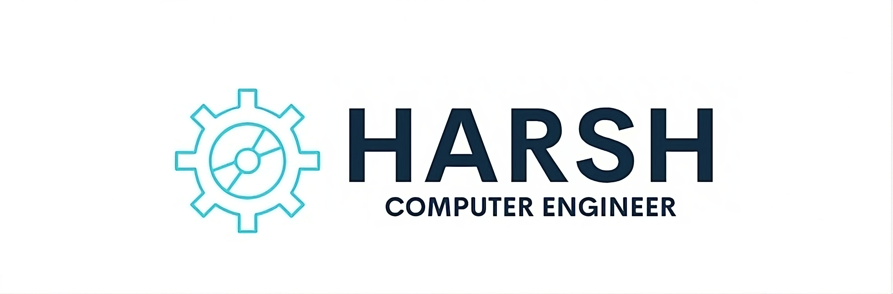

<h1 align="center">Hi 👋, I'm Harshal Bhavsar</h1>

<h3 align="center">A passionate frontend developer from India</h3>

 <audio src="WhatsApp Audio 2023-12-21 at 23.50.48_94dd5dd6.mp3" autoplay></audio >

  

- 💬 Ask me about **Web Devlopment and Cyber Security**

- 📫 How to reach me **hbhavsar847@gmail.com**

- ⚡ Fun fact **I Dont Know About Coding**

<h3 align="left">Connect with me:</h3>

<h3 align="left">Languages and Tools:</h3>

                  

<h3 align="left">Support:</h3>

  

